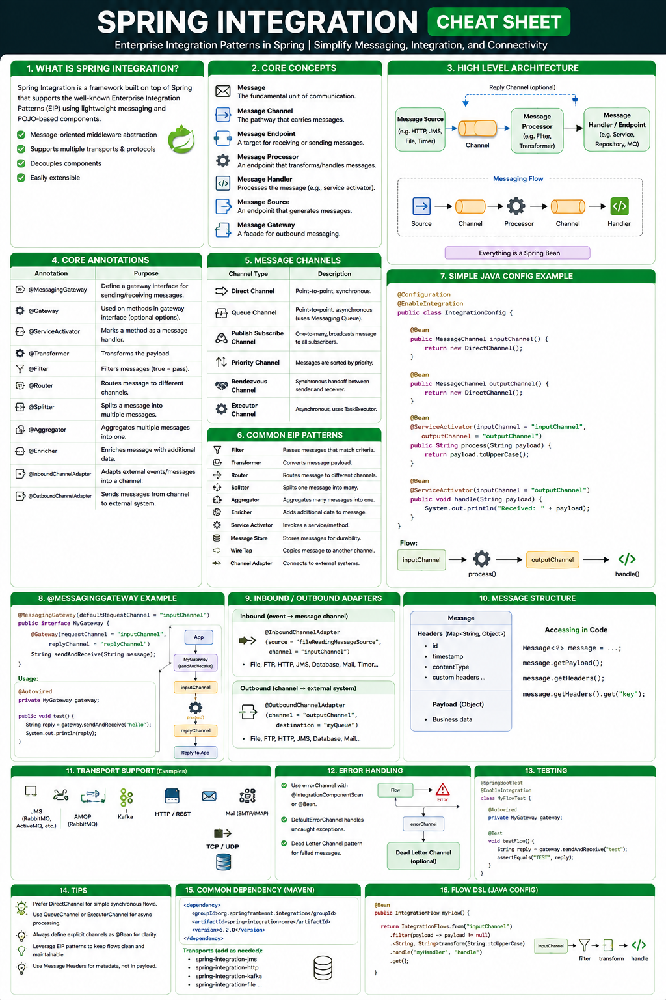
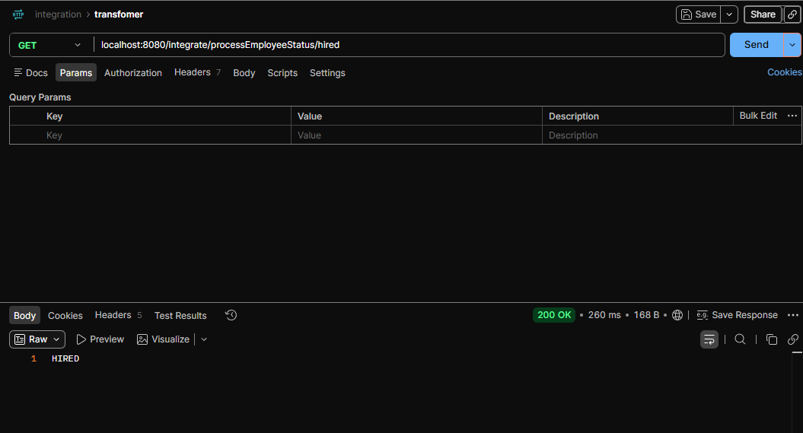
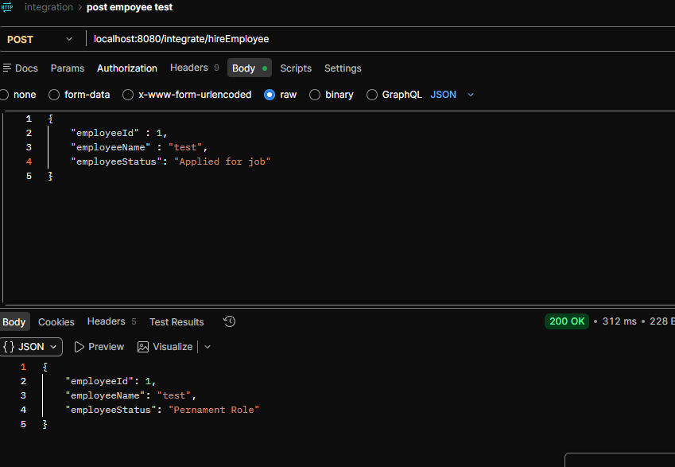
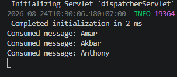
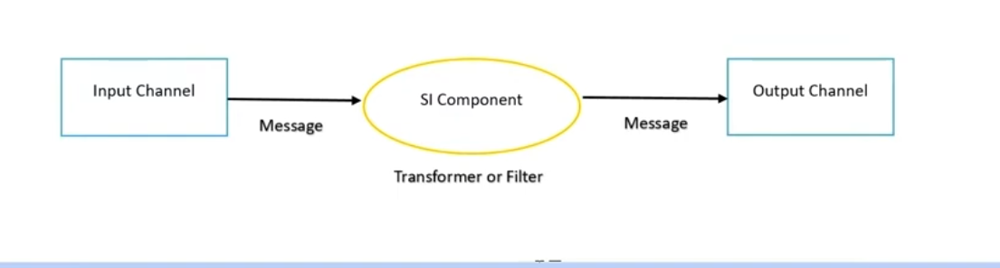

## CHEATSHEET

## Spring-integration

Spring Integration is an open source framework, that enables lightweight messaging, within Spring based applications, and, also supports integration with external systems.

- Try to calll endpoint and see how the flow integration works with controller-gateway-serviceActivator
  

- Try to call enpoint and learn about tranformers
  

- Try to call endpoint and how the splitter works: it sent finally manager and seee the logs we have several manager name.
  
  

## Components

- Producer, Consumer, channel, message, endpoints.
- Tranformer: A transformer takes a message from a channel and creates a new message containing coverted payload or message structure.
- Splitter: The splitter is a SI component whole role is to partition a message into several parts and send the resulting messages to be processed independently.
- Filter: message filters are used to decide whether a message should be passed along orr dropped bassed on some criteria.
<!-- ## The series

- Spring integration
- SI components
- Project creation
- Project execution

## Components

- Producer, Consumer, channel, message, endpoints.
- Transformer and filter:

* A tranformer coverts the content off a message
* A filter determines if a message can continue its wway to the output channel.

- Router: decides to which channel the message will be sent. -->
